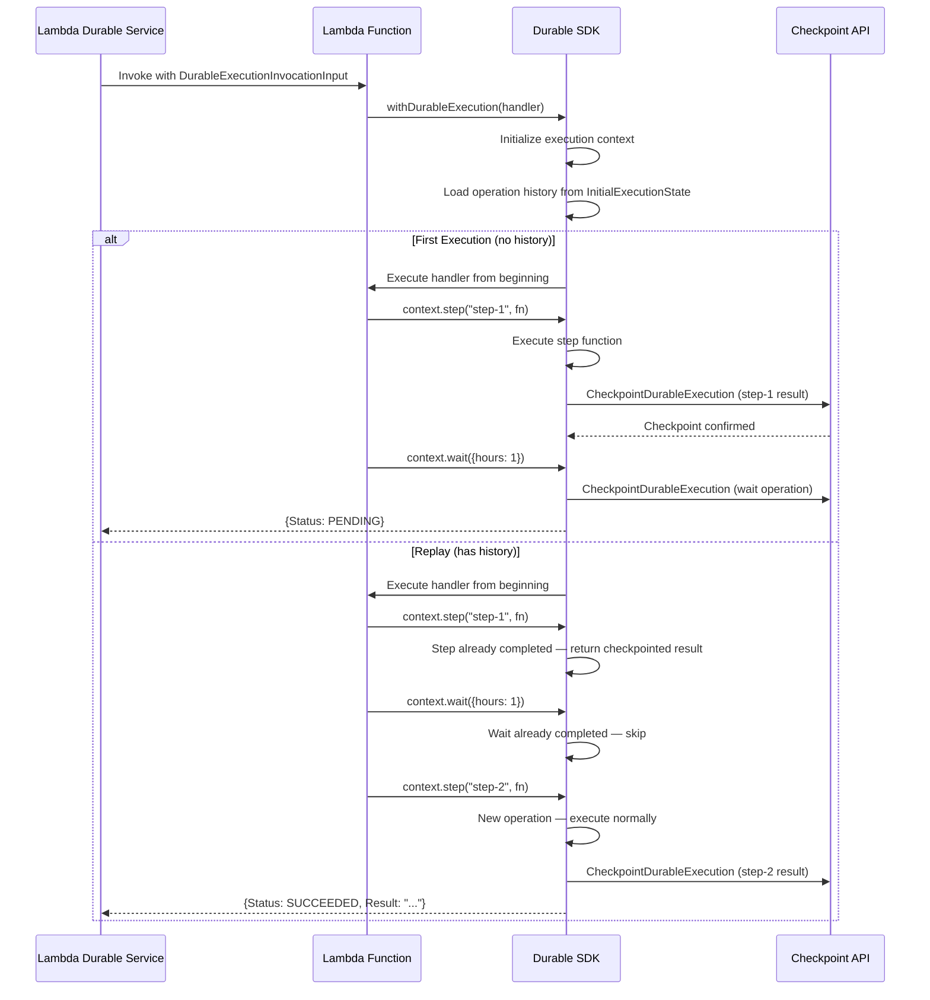
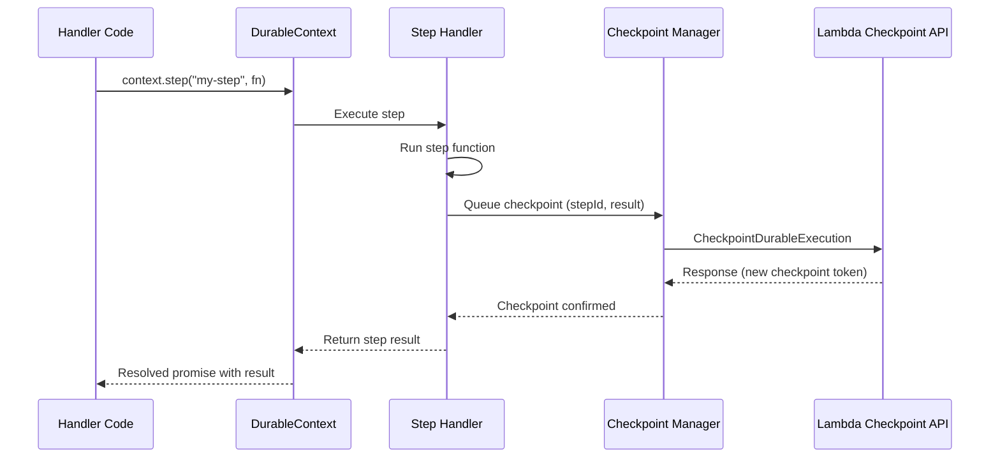
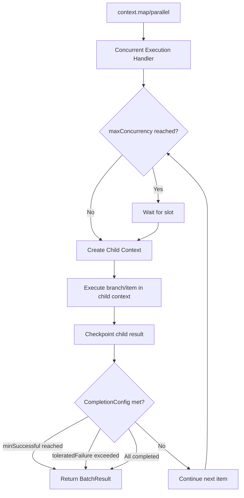
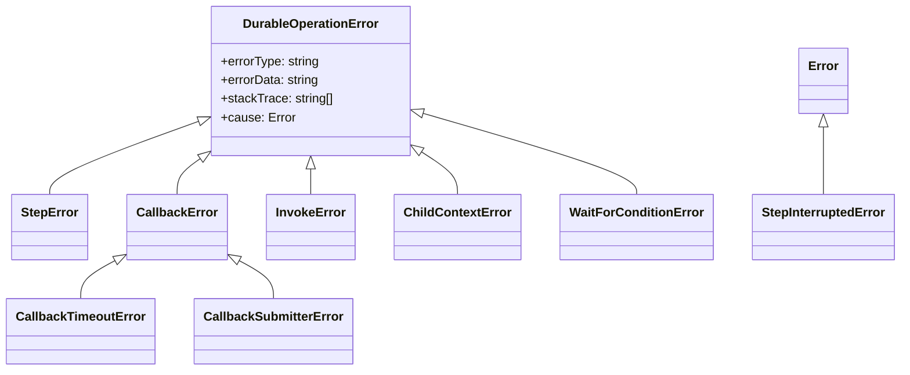

# Design Document: SDK Study Guide

## Overview

The SDK Study Guide is a collection of Markdown files that provide a comprehensive learning resource for developers working on the AWS Lambda Durable Functions SDK. The guide lives in a `/study_guide` directory at the repository root, with a `README.md` entry point and individual chapter files organized in a logical learning progression.

The guide is a documentation artifact — not a runtime system. The "architecture" here describes the file structure, content organization, cross-referencing strategy, and diagram conventions. The design prioritizes:

- **Navigability**: Relative links and consistent navigation patterns across all chapters
- **Depth**: Full coverage of every consumer-facing interface, configuration, and internal concept
- **Reusability**: Language-agnostic prose with language-specific code examples, single repository reference
- **Visual clarity**: Mermaid diagrams for request paths, lifecycle flows, and concurrency models

## Architecture

### File Structure

```
study_guide/
├── README.md                          # Entry point: title, overview, table of contents, references
├── 01-overview.md                     # Durable functions overview, replay model, determinism
├── 02-lambda-function-structure.md    # How consumers structure a Lambda to use the SDK
├── 03-consumer-interfaces.md          # DurableContext, withDurableExecution, DurablePromise
├── 04-api-interaction.md              # Lambda API request paths, input/output structures
├── 05-threading-and-concurrency.md    # Child contexts, checkpoint manager, termination
├── 06-configuration-reference.md      # All consumer-facing configuration interfaces
├── 07-error-handling.md               # Error hierarchy, serialization, saga pattern
├── 08-testing.md                      # LocalDurableTestRunner, CloudDurableTestRunner
├── 09-common-patterns.md              # GenAI agent, human-in-the-loop, saga, fan-out/fan-in
└── 10-references.md                   # Consolidated links to source, API docs, external resources
```

### Chapter Ordering Rationale

The chapters follow a learning progression:
1. **Overview** — foundational concepts before any API details
2. **Lambda Function Structure** — how to set up a project (context for everything that follows)
3. **Consumer Interfaces** — the core API surface (the "what")
4. **API Interaction** — how the SDK talks to the backend (the "how")
5. **Threading and Concurrency** — deeper execution model understanding
6. **Configuration Reference** — detailed knobs and options (reference material)
7. **Error Handling** — failure modes and recovery patterns
8. **Testing** — how to validate durable functions
9. **Common Patterns** — practical application of all prior knowledge
10. **References** — consolidated external links

### Navigation Convention

Every chapter file follows this structure:

```markdown
# Chapter Title

[Chapter content...]

---

[← Previous: Chapter Name](./previous-chapter.md) | [Next: Chapter Name →](./next-chapter.md)
```

The first chapter links back to the entry point. The last chapter links to the references page. Cross-references between chapters use relative links: `[DurableContext](./03-consumer-interfaces.md#durablecontext)`.

## Components and Interfaces

Since this is a documentation project, "components" are the chapter files and "interfaces" are the content contracts each chapter must fulfill.

### Component: Entry Point (`README.md`)

**Responsibilities:**
- Display the study guide title and a 2-3 paragraph overview
- Provide a numbered table of contents with relative links to each chapter
- Include a "Prerequisites" section listing assumed knowledge (Lambda basics, async/await)
- Include a "References" section with links to:
  - AWS Lambda Durable Functions documentation
  - SDK README in the Target_Repository
  - API reference documentation in `docs/api-reference/`
  - CONCEPTS.md in the SDK source

**Content structure:**
```markdown
# AWS Lambda Durable Functions SDK — Developer Study Guide

## Overview
[2-3 paragraphs explaining what this guide covers and who it's for]

## Prerequisites
- Familiarity with AWS Lambda
- Understanding of async/await patterns
- Basic knowledge of the target language (TypeScript/JavaScript for this repository)

## Table of Contents
1. [Overview and Conceptual Foundation](./01-overview.md)
2. [Lambda Function Structure](./02-lambda-function-structure.md)
...

## References
- [AWS Lambda Durable Functions Guide](https://docs.aws.amazon.com/lambda/latest/dg/durable-functions.html)
- [SDK README](../packages/aws-durable-execution-sdk-js/README.md)
- [API Reference](../docs/api-reference/index.md)
- [Concepts Document](../packages/aws-durable-execution-sdk-js/src/documents/CONCEPTS.md)
```

### Component: Chapter 01 — Overview and Conceptual Foundation

**Responsibilities:**
- Explain what durable functions are and the problems they solve (long-running workflows, state persistence, cost efficiency)
- Explain the Replay Model with a step-by-step walkthrough
- Include a Mermaid sequence diagram: first execution → checkpoint → suspension → replay → skip completed → execute new
- Explain the determinism requirement with correct/incorrect code examples
- Explain the relationship between SDK and Lambda backend APIs at a high level

**Key diagram — Durable Function Lifecycle:**


### Component: Chapter 02 — Lambda Function Structure

**Responsibilities:**
- Show the complete file structure of a durable Lambda function
- Explain `DurableExecutionHandler<TEvent, TResult, TLogger>` type parameters
- Explain `DurableLambdaHandler` and the transformation via `withDurableExecution`
- Show `DurableExecutionConfig` with optional custom Lambda client
- Document IAM permissions: `AWSLambdaBasicDurableExecutionRolePolicy` and additional permissions for invokes/callbacks
- Explain qualified ARN requirement with examples of valid/invalid invocations
- Include IaC examples (CloudFormation, CDK, SAM) showing `DurableConfig`

### Component: Chapter 03 — Consumer Interfaces

**Responsibilities:**
- Document `withDurableExecution(handler, config?)` — the entry point wrapper
- Document every `DurableContext` method with signature, parameters, return type, config options, and code example:
  - `step(name?, fn, config?)` — atomic operations with checkpointing
  - `wait(name?, duration)` — time-based suspension
  - `invoke(name?, functionArn, payload, config?)` — durable function chaining
  - `runInChildContext(name?, fn, config?)` — isolated child execution
  - `waitForCallback(name?, submitter, config?)` — external system integration
  - `createCallback(name?, config?)` — manual callback creation
  - `waitForCondition(name?, checkFn, config?)` — polling with wait strategy
  - `map(name?, items, fn, config?)` — parallel array processing
  - `parallel(name?, branches, config?)` — parallel branch execution
  - `configureLogger(config)` — logger configuration
- Document `context.promise` property: `all`, `allSettled`, `any`, `race` with guidance on when to use vs `map`/`parallel`
- Document `DurablePromise` class: lazy execution, `isExecuted`, difference from native Promise
- Document `context.logger` — replay-aware, mode-aware logging
- Document `context.lambdaContext` — access to underlying Lambda context

### Component: Chapter 04 — API Interaction and Request Paths

**Responsibilities:**
- Explain `DurableExecutionClient` interface: `getExecutionState` and `checkpoint` methods
- Explain `DurableExecutionApiClient` as the concrete implementation
- Document `DurableExecutionInvocationInput`: `DurableExecutionArn`, `CheckpointToken`, `InitialExecutionState` (with `Operations[]` and `NextMarker`)
- Document `DurableExecutionInvocationOutput`: `SUCCEEDED` (with optional `Result`), `FAILED` (with `Error`), `PENDING`
- Document `InvocationStatus` enum
- Document `OperationSubType` enum with all values: STEP, WAIT, CALLBACK, RUN_IN_CHILD_CONTEXT, MAP, MAP_ITERATION, PARALLEL, PARALLEL_BRANCH, WAIT_FOR_CALLBACK, WAIT_FOR_CONDITION, CHAINED_INVOKE
- Include Mermaid sequence diagrams for first execution and replay request paths
- Include links to Lambda API docs

**Key diagram — Checkpoint Request Path:**


### Component: Chapter 05 — Threading, Concurrency, and Execution Model

**Responsibilities:**
- Explain why child contexts are necessary for deterministic replay (isolated step counters)
- Explain the checkpoint manager: queue-based processing, async checkpoint submission
- Explain the `Promise.race` between handler promise and termination promise in `withDurableExecution`
- Explain the termination manager and `TerminationReason` variants: `CHECKPOINT_FAILED`, `SERDES_FAILED`, `CONTEXT_VALIDATION_ERROR`
- Explain `EventEmitter`-based step data communication
- Explain execution context initialization: loading operation history, pagination via `NextMarker`
- Explain how `map` and `parallel` coordinate concurrent child contexts with the concurrent execution handler

**Key diagram — Concurrent Execution Model:**


### Component: Chapter 06 — Configuration Reference

**Responsibilities:**
- Document every configuration interface in a reference format with tables
- For each config: interface name, properties, types, defaults, description
- Covers: `StepConfig`, `RetryStrategyConfig`, `retryPresets`, `WaitForCallbackConfig`, `CreateCallbackConfig`, `WaitForConditionConfig`, `WaitStrategyConfig`, `MapConfig`, `ParallelConfig`, `ConcurrencyConfig`, `CompletionConfig`, `ChildConfig`, `InvokeConfig`, `DurableExecutionConfig`, `LoggerConfig`, `Serdes`, `Duration`
- Include code examples for `createRetryStrategy`, `createWaitStrategy`, custom `Serdes`, `createClassSerdes`, `createClassSerdesWithDates`
- Link to source files for each interface

### Component: Chapter 07 — Error Handling

**Responsibilities:**
- Document the error hierarchy with a class diagram
- Document each error type: `DurableOperationError`, `StepError`, `CallbackError`, `CallbackTimeoutError`, `CallbackSubmitterError`, `InvokeError`, `ChildContextError`, `WaitForConditionError`, `StepInterruptedError`
- Explain error serialization across checkpoints: `ErrorObject` with `errorType`, `errorMessage`, `errorData`, `stackTrace`
- Explain recoverable vs unrecoverable errors
- Document `BatchResult` error handling: `throwIfError()`, `getErrors()`, `hasFailure`, `failed()`
- Include saga pattern code example

**Key diagram — Error Hierarchy:**


### Component: Chapter 08 — Testing

**Responsibilities:**
- Document `LocalDurableTestRunner`: setup/teardown, run, operation inspection, fake clock, function registration
- Document `CloudDurableTestRunner`: constructor, run with polling, operation inspection
- Document `TestResult`: status, result, error, operations, invocations, history events, print
- Document `DurableOperation`: type, status, name, details (step, wait, callback, chained invoke, context), child operations, callback methods
- Document enums: `OperationType`, `OperationStatus`, `ExecutionStatus`, `InvocationType`, `WaitingOperationStatus`
- Include complete test examples for: basic step, callback, wait, parallel/map
- Explain local vs cloud testing tradeoffs

### Component: Chapter 09 — Common Patterns

**Responsibilities:**
- GenAI agentic loop (step in while loop)
- Human-in-the-loop approval (waitForCallback)
- Saga pattern (compensating transactions with try/catch)
- Fan-out/fan-in (invoke + promise.all, or map)
- Polling (waitForCondition + createWaitStrategy)
- Concurrent processing (map with maxConcurrency + completionConfig)
- Each pattern includes: description, when to use, complete code example, key considerations

### Component: Chapter 10 — References

**Responsibilities:**
- Consolidated list of all external links used throughout the guide
- Organized by category: AWS Documentation, SDK Source, API Reference, Related Guides
- All links verified and described

## Data Models

This project produces Markdown files, not runtime data structures. The "data model" is the content schema for each chapter.

### Chapter Content Schema

Each chapter file follows this structure:

```
---
Title: string (H1 heading)
---
Introduction: 1-2 paragraphs setting context
Sections: H2 headings for major topics
  Subsections: H3 headings for detailed breakdowns
  Code Examples: fenced code blocks with language tags
  Diagrams: Mermaid code blocks
  Tables: for configuration reference (property | type | default | description)
  Links: relative links to source files, other chapters, external docs
Navigation Footer: Previous/Next links
```

### Link Reference Model

Links in the study guide fall into three categories:

| Category | Format | Example |
|----------|--------|---------|
| Inter-chapter | `./filename.md` or `./filename.md#anchor` | `[DurableContext](./03-consumer-interfaces.md#durablecontext)` |
| Source code | `../relative/path/to/file.ts` | `[source](../packages/aws-durable-execution-sdk-js/src/types/durable-context.ts)` |
| External docs | Full URL | `[Lambda API](https://docs.aws.amazon.com/lambda/latest/dg/durable-functions.html)` |


## Correctness Properties

*A property is a characteristic or behavior that should hold true across all valid executions of a system — essentially, a formal statement about what the system should do. Properties serve as the bridge between human-readable specifications and machine-verifiable correctness guarantees.*

Since this is a documentation generation project, correctness properties focus on structural integrity and completeness of the generated Markdown files rather than runtime behavior.

### Property 1: All inter-chapter links are relative

*For any* Markdown file in the study guide, and *for any* link in that file that targets another file within the study guide or the Target_Repository, the link path SHALL be a relative path (not an absolute URL or absolute filesystem path).

**Validates: Requirements 1.3, 1.5, 10.4**

### Property 2: Every chapter has navigation links

*For any* chapter file in the study guide (excluding README.md), the file SHALL contain a "Previous" link and a "Next" link at the bottom, and each link SHALL resolve to an existing file in the study guide directory.

**Validates: Requirements 1.6**

### Property 3: Every DurableContext method is documented with signature and example

*For any* public method on the DurableContext interface (`step`, `wait`, `invoke`, `runInChildContext`, `waitForCallback`, `createCallback`, `waitForCondition`, `map`, `parallel`, `configureLogger`), the consumer interfaces chapter SHALL contain a section for that method that includes at least one fenced code block.

**Validates: Requirements 3.2, 3.3**

### Property 4: All code blocks use the Target_Repository language

*For any* fenced code block in the study guide that contains SDK usage examples, the code block SHALL specify a language identifier matching the Target_Repository's language (e.g., `typescript` for the JS/TS SDK).

**Validates: Requirements 12.3**

### Property 5: Lambda API references include external documentation links

*For any* chapter that references a Lambda Durable Functions backend API (CheckpointDurableExecution, GetDurableExecutionState, SendDurableExecutionCallbackSuccess, SendDurableExecutionCallbackFailure), the chapter SHALL include at least one external link to `docs.aws.amazon.com`.

**Validates: Requirements 4.7, 11.2**

## Error Handling

Since this is a documentation project, "errors" are content generation issues:

| Error Condition | Handling Strategy |
|----------------|-------------------|
| Source file referenced in a link no longer exists | Use relative links based on current repository structure; validate links during implementation |
| External documentation URL is broken | Include URLs from official AWS documentation; note that external links may change |
| Mermaid diagram syntax error | Validate Mermaid syntax by ensuring diagrams follow documented Mermaid grammar |
| Chapter content exceeds reasonable length | Split into sub-sections with clear headings; target ~500-1000 lines per chapter |
| Missing coverage of an SDK interface | Cross-reference the chapter content against the SDK's `index.ts` exports during implementation |

## Testing Strategy

### Unit Tests (Example-Based)

Since the output is Markdown files, unit tests verify specific structural expectations:

- **Entry point structure**: Verify `README.md` contains H1 title, overview section, numbered TOC, and references section
- **Chapter existence**: Verify all 10 chapter files exist in the `study_guide/` directory
- **Mermaid diagram presence**: Verify chapters 01, 04, 05, and 07 contain Mermaid code blocks
- **Configuration coverage**: Verify chapter 06 mentions all configuration interfaces listed in the design
- **Error type coverage**: Verify chapter 07 mentions all error types from the SDK's error hierarchy
- **Test runner coverage**: Verify chapter 08 documents both LocalDurableTestRunner and CloudDurableTestRunner
- **Pattern coverage**: Verify chapter 09 contains sections for all 6 required patterns

### Property-Based Tests

Property-based tests validate universal structural properties across all generated files:

- **Property 1**: Parse all Markdown files, extract all links, verify none are absolute URLs to the same repository or absolute filesystem paths
- **Property 2**: For each chapter file, parse the last section and verify it contains navigation links that resolve to existing files
- **Property 3**: Parse the consumer interfaces chapter, extract H2/H3 headings, verify each DurableContext method has a heading and an associated code block
- **Property 4**: Parse all Markdown files, extract fenced code blocks, verify SDK example blocks specify the correct language tag
- **Property 5**: Parse chapters that mention Lambda API names, verify they contain at least one `docs.aws.amazon.com` link

### Testing Library

For a TypeScript/JavaScript repository, use `fast-check` for property-based testing with Jest or Vitest as the test runner. Each property test should run a minimum of 100 iterations. Since the inputs here are generated file contents rather than random data, the property tests will operate as structural validators across the file set.

**Tag format**: `Feature: sdk-study-guide, Property {N}: {property_text}`
