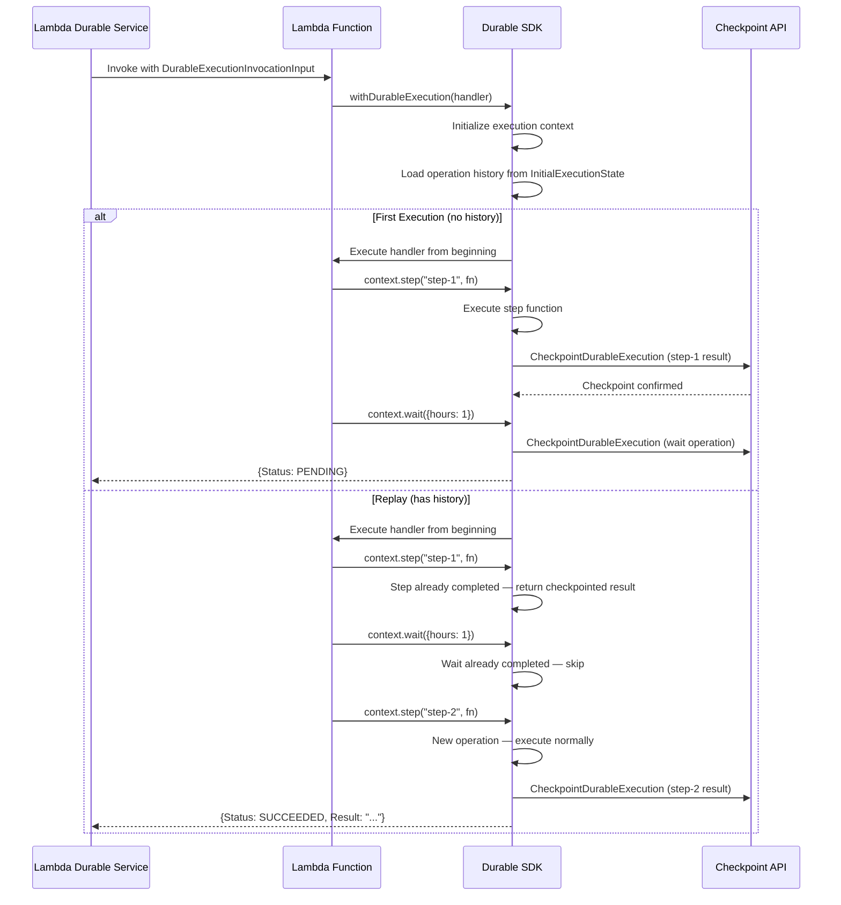

# Overview and Conceptual Foundation

Durable functions extend the AWS Lambda programming model to support multi-step, long-running workflows with automatic state persistence. This chapter introduces the core concepts you need before working with the SDK: what problems durable functions solve, how the replay model works, why determinism matters, and how the SDK relates to the Lambda backend APIs.

## What Are Durable Functions?

A standard Lambda function runs a single block of code within a 15-minute timeout. If the function fails partway through, all progress is lost. If the workflow needs to wait for an external event — a human approval, a scheduled delay, a third-party callback — the function must either poll (paying for idle compute) or offload coordination to an external state machine.

Durable functions remove these constraints. With the SDK, you write a single function that:

- **Persists state automatically.** Each operation's result is checkpointed. If the function fails or is suspended, it resumes from the last checkpoint rather than starting over.
- **Runs for extended periods.** While each individual operation is still bounded by Lambda's 15-minute timeout, the overall workflow can span hours, days, or months by suspending between operations.
- **Suspends without cost.** When a function calls `context.wait()` or `context.waitForCallback()`, the invocation ends. No compute is billed during the wait. Lambda re-invokes the function when the wait completes.
- **Retries transparently.** Steps can be configured with retry strategies (exponential backoff, jitter, max attempts). The SDK handles retries automatically and checkpoints the final result.
- **Composes complex workflows.** Child contexts, parallel branches, map operations, and durable invokes let you build sophisticated orchestration logic within a single function definition.

In short, durable functions give you the reliability of a workflow engine with the simplicity of writing a regular async function.

## The Replay Model

The replay model is the central concept behind durable functions. Understanding it is essential for writing correct durable code.

### How It Works

When a durable function is first invoked, Lambda runs the handler from the beginning. The SDK executes each durable operation (step, wait, invoke, etc.) normally and checkpoints the result via the Lambda Checkpoint API. If the function needs to wait — for a timer, a callback, or because it completed — the invocation ends.

When Lambda invokes the function again (after a wait expires, a callback arrives, or a retry is needed), the function runs from the beginning again. This time, the SDK has the operation history from the previous invocation. As the handler code re-executes, the SDK checks each durable operation against the history:

- **Already completed?** Return the checkpointed result immediately without re-executing the operation's function.
- **Not yet completed?** Execute the operation normally, checkpoint the result, and continue.

This is replay. The handler code runs from the top every time, but completed operations are skipped by returning their stored results.

### Step-by-Step Walkthrough

Consider a function with two steps and a wait:

```typescript
import { withDurableExecution, DurableContext } from "@aws/durable-execution-sdk-js";

export const handler = withDurableExecution(async (event: any, context: DurableContext) => {
  const data = await context.step("fetch-data", async () => fetchFromAPI(event.id));
  await context.wait("cooldown", { hours: 1 });
  const result = await context.step("process", async () => transform(data));
  return result;
});
```

**First invocation (no history):**

1. The SDK initializes the execution context with an empty operation history.
2. `context.step("fetch-data", ...)` — no history for this step. The SDK executes `fetchFromAPI()`, checkpoints the result, and returns it.
3. `context.wait("cooldown", { hours: 1 })` — the SDK checkpoints the wait operation and returns a `PENDING` status to the Lambda service. The invocation ends. No compute is billed during the 1-hour wait.

**Replay invocation (after the wait expires):**

1. The SDK initializes the execution context and loads the operation history from the previous invocation. The history contains: `fetch-data` (completed), `cooldown` (completed).
2. `context.step("fetch-data", ...)` — the SDK finds this step in the history. It returns the checkpointed result without calling `fetchFromAPI()` again.
3. `context.wait("cooldown", { hours: 1 })` — the SDK finds this wait in the history. It skips the wait and continues.
4. `context.step("process", ...)` — no history for this step. The SDK executes `transform(data)`, checkpoints the result, and returns it.
5. The handler returns `result`. The SDK sends a `SUCCEEDED` status with the return value.

### Lifecycle Diagram

The following diagram shows the full lifecycle of a durable function invocation, covering both the first execution and a subsequent replay:



## The Determinism Requirement

Because the handler re-executes from the beginning on every replay, all code outside of durable operations must produce the same results every time. If code outside a step returns a different value on replay, the function's behavior diverges from the original execution, leading to incorrect results or runtime errors.

### What Must Be Deterministic

Any code that runs between durable operations — variable assignments, conditionals, loop bounds, function arguments — must be deterministic. The SDK matches operations to their checkpointed results by their position and name in the execution sequence. If non-deterministic code changes the sequence of operations between invocations, the SDK cannot correctly replay the function.

### What Is Non-Deterministic

The following produce different values on each invocation and must be placed inside a step:

- **Current time:** `Date.now()`, `new Date()`
- **Random values:** `Math.random()`, UUID generation (`uuid.v4()`)
- **External calls:** API requests, database queries, file system reads
- **Environment-dependent values:** Anything that could change between invocations

### Incorrect Patterns

```typescript
// ❌ WRONG: Non-deterministic values outside steps
const id = uuid.v4();              // Different on each replay!
const timestamp = Date.now();       // Different on each replay!
const config = await fetchConfig(); // May return different results!

await context.step("process", async () => {
  return process(id, timestamp, config);
});
```

On the first invocation, `id` might be `"abc-123"` and `timestamp` might be `1700000000000`. On replay, they will be completely different values, but the step's checkpointed result was computed with the original values. The function's behavior is now inconsistent.

### Correct Patterns

```typescript
// ✅ CORRECT: Non-deterministic values inside steps
const id = await context.step("generate-id", async () => uuid.v4());
const timestamp = await context.step("get-time", async () => Date.now());
const config = await context.step("fetch-config", async () => fetchConfig());

await context.step("process", async () => {
  return process(id, timestamp, config);
});
```

Now `id`, `timestamp`, and `config` are checkpointed. On replay, the SDK returns the same values from the first invocation without re-executing the step functions.

### Side Effects Outside Steps

Side effects placed outside steps repeat on every replay:

```typescript
// ❌ WRONG: Side effect outside a step
console.log("Starting workflow");  // Logs on every replay
await sendMetric("workflow.start"); // Sends metric on every replay

await context.step("do-work", async () => doWork());
```

```typescript
// ✅ CORRECT: Use the replay-aware logger, wrap side effects in steps
context.logger.info("Starting workflow"); // Only logs on non-replay invocations

await context.step("record-start", async () => sendMetric("workflow.start"));
await context.step("do-work", async () => doWork());
```

The `context.logger` is replay-aware — it suppresses log output during replay by default, so you can use it freely outside steps without generating duplicate log entries.

### No Nested Durable Operations

Durable operations cannot be called inside a step function. Steps are atomic — they execute a single function and checkpoint the result. If you need to group multiple durable operations, use `runInChildContext`:

```typescript
// ❌ WRONG: Nested durable operations
await context.step("process", async () => {
  await context.wait({ seconds: 1 });   // ERROR: durable operation inside a step
  await context.step(async () => ...);   // ERROR: durable operation inside a step
});

// ✅ CORRECT: Use child context for grouping
await context.runInChildContext("process", async (childCtx) => {
  await childCtx.step("sub-step", async () => doWork());
  await childCtx.wait({ seconds: 1 });
  await childCtx.step("follow-up", async () => followUp());
});
```

## SDK and Lambda API Relationship

The SDK is a client-side library that runs inside the Lambda function's execution environment. It does not manage infrastructure or orchestrate invocations — that is the Lambda Durable Functions service's responsibility. The relationship between the SDK and the backend works as follows:

### The Lambda Service's Role

The Lambda Durable Functions service:

- Manages the lifecycle of durable executions (creation, suspension, resumption, completion)
- Stores checkpointed operation results
- Delivers the operation history to the function on replay
- Handles timer scheduling and callback routing
- Re-invokes the function when a wait expires or a callback arrives

### The SDK's Role

The SDK:

- Wraps the developer's handler function via `withDurableExecution`
- Manages the execution context (operation history, step counters, child contexts)
- Decides whether to execute or skip each operation based on the history
- Calls the `CheckpointDurableExecution` API to persist operation results
- Calls the `GetDurableExecutionState` API to load additional operation history when paginated
- Returns the appropriate status (`SUCCEEDED`, `FAILED`, or `PENDING`) to the service

### The Two Key APIs

The SDK interacts with two Lambda backend APIs:

| API | Purpose |
|-----|---------|
| `CheckpointDurableExecution` | Persists the result of a completed operation (step result, wait registration, callback registration, etc.) |
| `GetDurableExecutionState` | Retrieves additional pages of operation history when the initial state is paginated via `NextMarker` |

The service provides the initial operation history in the `DurableExecutionInvocationInput` payload when it invokes the function. The SDK uses this history for replay. If the history is too large to fit in a single payload, the SDK paginates through it using `GetDurableExecutionState`.

For a deeper look at the request paths and data structures involved, see [API Interaction and Request Paths](./04-api-interaction.md).

## Key Takeaways

- Durable functions persist state across invocations through checkpointing. Each operation's result is stored so it can be replayed without re-execution.
- The replay model re-runs the handler from the beginning on every invocation. Completed operations return their checkpointed results; new operations execute normally.
- Code outside durable operations must be deterministic. Non-deterministic values (time, random, external calls) must be wrapped in steps.
- The SDK is a client-side library that communicates with the Lambda Durable Functions service via `CheckpointDurableExecution` and `GetDurableExecutionState` APIs.
- Functions suspend without cost during waits and callbacks — you only pay for active compute time.

---

[← Previous: Developer Study Guide](./README.md) | [Next: Lambda Function Structure →](./02-lambda-function-structure.md)
