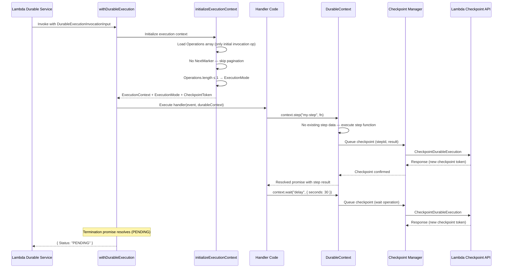
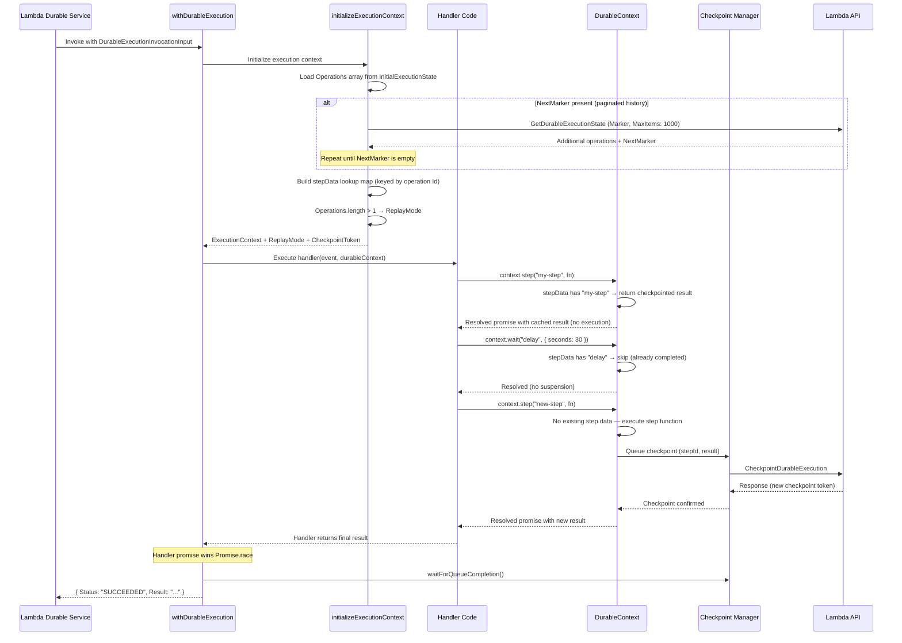
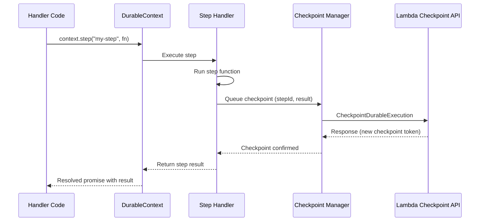

# API Interaction and Request Paths

This chapter explains how the Durable Functions SDK communicates with the Lambda Durable Functions backend. It covers the client interface used for checkpointing and state retrieval, the input/output structures that flow between the service and the SDK, the enums that classify operations and invocation outcomes, and the end-to-end request paths for both first execution and replay.

Understanding this layer is essential for reasoning about the system end-to-end — from the moment the Lambda service invokes your function, through checkpoint persistence, to the final response.

## `DurableExecutionClient` Interface

The SDK defines a `DurableExecutionClient` interface that abstracts all communication with the Lambda Durable Functions backend. This interface has two methods:

```typescript
interface DurableExecutionClient {
  getExecutionState(
    params: GetDurableExecutionStateRequest,
    logger?: DurableLogger,
  ): Promise<GetDurableExecutionStateResponse>;

  checkpoint(
    params: CheckpointDurableExecutionRequest,
    logger?: DurableLogger,
  ): Promise<CheckpointDurableExecutionResponse>;
}
```

| Method | Lambda API | Purpose |
|--------|-----------|---------|
| `getExecutionState` | `GetDurableExecutionState` | Retrieves persisted operation history during replay. Used when the initial operation list is paginated (`NextMarker` is present). |
| `checkpoint` | `CheckpointDurableExecution` | Persists operation results (step outputs, wait completions, callback results) to the backend. Returns a new checkpoint token for subsequent requests. |

Both methods accept an optional `DurableLogger` parameter. When provided, errors are logged through the developer-facing logger in addition to internal debug logging.

**Source:** [`packages/aws-durable-execution-sdk-js/src/types/durable-execution.ts`](../packages/aws-durable-execution-sdk-js/src/types/durable-execution.ts)

## `DurableExecutionApiClient` Implementation

`DurableExecutionApiClient` is the concrete implementation of `DurableExecutionClient`. It wraps the AWS SDK `LambdaClient` and sends `CheckpointDurableExecutionCommand` and `GetDurableExecutionStateCommand` requests.

```typescript
class DurableExecutionApiClient implements DurableExecutionClient {
  constructor(client?: LambdaClient);

  async getExecutionState(
    params: GetDurableExecutionStateRequest,
    logger?: DurableLogger,
  ): Promise<GetDurableExecutionStateResponse>;

  async checkpoint(
    params: CheckpointDurableExecutionRequest,
    logger?: DurableLogger,
  ): Promise<CheckpointDurableExecutionResponse>;
}
```

Key behaviors:

- **Default client creation:** If no `LambdaClient` is provided, a singleton default client is created with custom timeouts (`connectionTimeout: 5000ms`, `socketTimeout: 50000ms`, `requestTimeout: 55000ms`) and a custom user agent identifying the SDK name and version.
- **Error logging:** Both methods catch errors, log them internally with request metadata (request ID, ARN, checkpoint token), and re-throw. If a `DurableLogger` is provided, errors are also surfaced to the developer.
- **Custom client injection:** Consumers can provide their own `LambdaClient` via `DurableExecutionConfig.client` when calling `withDurableExecution`. This is useful for custom regions, credentials, VPC endpoints, or testing with mocked clients.

**Source:** [`packages/aws-durable-execution-sdk-js/src/durable-execution-api-client/durable-execution-api-client.ts`](../packages/aws-durable-execution-sdk-js/src/durable-execution-api-client/durable-execution-api-client.ts)

## `DurableExecutionInvocationInput`

When the Lambda Durable Functions service invokes your function, it provides a `DurableExecutionInvocationInput` as the event payload. This structure contains everything the SDK needs to initialize the execution context.

```typescript
interface DurableExecutionInvocationInput {
  DurableExecutionArn: string;
  CheckpointToken: string;
  InitialExecutionState: {
    Operations: Operation[];
    NextMarker?: string;
  };
}
```

| Field | Type | Description |
|-------|------|-------------|
| `DurableExecutionArn` | `string` | Amazon Resource Name uniquely identifying this durable execution instance. Used in all checkpoint and state retrieval API calls. |
| `CheckpointToken` | `string` | Token for the next checkpoint operation. Ensures idempotency — prevents duplicate checkpoints and validates that requests belong to the current execution cycle. Each successful checkpoint returns a new token. |
| `InitialExecutionState.Operations` | `Operation[]` | Array of previously completed operations with their results, types, subtypes, and identifiers. On first execution, this contains only the initial invocation operation. On replay, it contains the full history of completed operations. |
| `InitialExecutionState.NextMarker` | `string \| undefined` | Pagination marker. When the operation history is too large for a single response, this marker is used with `getExecutionState` to fetch additional pages. The SDK handles pagination automatically during initialization. |

### How the SDK Uses This Input

During initialization (`initializeExecutionContext`), the SDK:

1. Extracts the `CheckpointToken` and `DurableExecutionArn`
2. Copies the `Operations` array from `InitialExecutionState`
3. If `NextMarker` is present, calls `getExecutionState` in a loop to fetch all remaining pages (requesting up to 1000 operations per page)
4. Builds a `stepData` lookup map keyed by operation `Id` for O(1) access during replay
5. Determines the execution mode: if more than one operation exists, the SDK enters `ReplayMode`; otherwise it enters `ExecutionMode`

**Source:** [`packages/aws-durable-execution-sdk-js/src/types/core.ts`](../packages/aws-durable-execution-sdk-js/src/types/core.ts) | [`packages/aws-durable-execution-sdk-js/src/context/execution-context/execution-context.ts`](../packages/aws-durable-execution-sdk-js/src/context/execution-context/execution-context.ts)

## `DurableExecutionInvocationOutput`

The SDK returns a `DurableExecutionInvocationOutput` to the Lambda service. This is a discriminated union with three variants based on `InvocationStatus`:

```typescript
type DurableExecutionInvocationOutput =
  | DurableExecutionInvocationOutputSucceeded
  | DurableExecutionInvocationOutputFailed
  | DurableExecutionInvocationOutputPending;
```

### `SUCCEEDED`

```typescript
interface DurableExecutionInvocationOutputSucceeded {
  Status: InvocationStatus.SUCCEEDED;
  Result?: string;  // JSON-serialized handler return value
}
```

Returned when the handler completes normally. `Result` contains the JSON-serialized return value. If the result exceeds the Lambda response size limit (~6 MB), the SDK checkpoints the result and returns an empty string instead.

### `FAILED`

```typescript
interface DurableExecutionInvocationOutputFailed {
  Status: InvocationStatus.FAILED;
  Error: ErrorObject;  // { errorType, errorMessage, errorData?, stackTrace? }
}
```

Returned when the handler throws an unrecoverable error, or when a context validation error occurs. The `ErrorObject` contains structured error information including type, message, optional data, and stack trace.

### `PENDING`

```typescript
interface DurableExecutionInvocationOutputPending {
  Status: InvocationStatus.PENDING;
}
```

Returned when execution is suspended — typically because a `wait`, `waitForCallback`, or retry delay requires the function to yield. The service will re-invoke the function later to continue execution from the last checkpoint.

**Source:** [`packages/aws-durable-execution-sdk-js/src/types/core.ts`](../packages/aws-durable-execution-sdk-js/src/types/core.ts)

## `InvocationStatus` Enum

```typescript
enum InvocationStatus {
  SUCCEEDED = "SUCCEEDED",
  FAILED    = "FAILED",
  PENDING   = "PENDING",
}
```

| Value | Meaning | Service Behavior |
|-------|---------|-----------------|
| `SUCCEEDED` | Execution completed successfully with a final result | Execution is marked complete. No further invocations. |
| `FAILED` | Execution failed with an unrecoverable error | Execution is marked failed. No further automatic retries. |
| `PENDING` | Execution is continuing asynchronously (checkpointed) | Service schedules a future invocation to resume from the checkpoint. |

**Source:** [`packages/aws-durable-execution-sdk-js/src/types/core.ts`](../packages/aws-durable-execution-sdk-js/src/types/core.ts)

## `OperationSubType` Enum

Every durable operation is tagged with an `OperationSubType` that classifies what kind of operation it represents. This enables fine-grained observability and correct replay behavior.

```typescript
enum OperationSubType {
  STEP               = "Step",
  WAIT               = "Wait",
  CALLBACK           = "Callback",
  RUN_IN_CHILD_CONTEXT = "RunInChildContext",
  MAP                = "Map",
  MAP_ITERATION      = "MapIteration",
  PARALLEL           = "Parallel",
  PARALLEL_BRANCH    = "ParallelBranch",
  WAIT_FOR_CALLBACK  = "WaitForCallback",
  WAIT_FOR_CONDITION = "WaitForCondition",
  CHAINED_INVOKE     = "ChainedInvoke",
}
```

| SubType | DurableContext Method | Description |
|---------|---------------------|-------------|
| `STEP` | `context.step()` | Atomic operation with automatic retry and checkpointing |
| `WAIT` | `context.wait()` | Time-based delay that suspends execution |
| `CALLBACK` | `context.createCallback()` | Callback creation for external system integration |
| `RUN_IN_CHILD_CONTEXT` | `context.runInChildContext()` | Isolated child context with its own step counter |
| `MAP` | `context.map()` | Parent operation coordinating parallel array processing |
| `MAP_ITERATION` | *(internal)* | Individual item within a `map` — each runs in its own child context |
| `PARALLEL` | `context.parallel()` | Parent operation coordinating parallel branch execution |
| `PARALLEL_BRANCH` | *(internal)* | Individual branch within a `parallel` — each runs in its own child context |
| `WAIT_FOR_CALLBACK` | `context.waitForCallback()` | Combined callback creation + submission + wait |
| `WAIT_FOR_CONDITION` | `context.waitForCondition()` | Periodic polling until a condition is met |
| `CHAINED_INVOKE` | `context.invoke()` | Durable invocation of another Lambda function |

Note that `MAP_ITERATION` and `PARALLEL_BRANCH` are internal subtypes — they are not directly created by consumer code but are generated by the SDK when processing items within `map` or branches within `parallel`.

**Source:** [`packages/aws-durable-execution-sdk-js/src/types/core.ts`](../packages/aws-durable-execution-sdk-js/src/types/core.ts)

## Request Path: First Execution

On the very first invocation of a durable function, there is no operation history to replay. The SDK executes the handler from the beginning, checkpointing each operation as it completes.



The key points:

1. `InitialExecutionState.Operations` contains only the initial invocation operation (the event payload), so the SDK enters `ExecutionMode`.
2. Each `context.step()` call executes the step function, then queues a checkpoint with the result.
3. The `CheckpointManager` sends `CheckpointDurableExecution` requests to the Lambda API, receiving a new `CheckpointToken` with each response.
4. When a `context.wait()` is encountered, the SDK checkpoints the wait operation and the termination promise resolves, causing `withDurableExecution` to return `PENDING`.

## Request Path: Replay Execution

When the service re-invokes the function (after a wait expires, a callback completes, or a retry is scheduled), the SDK replays the handler from the beginning, skipping operations that were already checkpointed.



The key points:

1. During initialization, the SDK loads the full operation history. If `NextMarker` is present, it paginates through `GetDurableExecutionState` until all operations are loaded.
2. The `stepData` map provides O(1) lookup by operation ID. When the handler calls `context.step("my-step", fn)`, the SDK checks `stepData` first — if the operation exists and is completed, the checkpointed result is returned immediately without executing `fn`.
3. Previously completed waits and callbacks are also skipped during replay.
4. When the handler reaches a new operation (not in `stepData`), it executes normally and checkpoints the result.
5. The `Promise.race` between the handler promise and the termination promise determines the outcome. If the handler completes, `SUCCEEDED` is returned. If a wait or checkpoint failure triggers termination, `PENDING` or `FAILED` is returned.

## Checkpoint Request Path (Detail)

This diagram zooms into the checkpoint flow for a single step operation, showing the interaction between the handler code, the `DurableContext`, the step handler, the `CheckpointManager`, and the Lambda Checkpoint API.



The `CheckpointManager` processes checkpoints through a queue:

1. Operations queue their results via `checkpoint(stepId, update)`.
2. The manager batches queued checkpoints and sends them to the Lambda API using `CheckpointDurableExecution`.
3. On success, the manager updates the local `stepData` map with the response operations and resolves any waiting operation promises via an `EventEmitter`.
4. On failure, the manager classifies the error and may trigger termination through the `TerminationManager`.

## The `Promise.race` Pattern

Inside `withDurableExecution`, the SDK races two promises:

```typescript
const [resultType, result] = await Promise.race([
  handlerPromise,      // Resolves when handler returns
  terminationPromise,  // Resolves when termination is triggered
]);
```

| Winner | Cause | Output Status |
|--------|-------|---------------|
| Handler promise | Handler completed normally | `SUCCEEDED` (with serialized result) |
| Termination promise (`CHECKPOINT_FAILED`) | Checkpoint API returned an unrecoverable error | Error is re-thrown (Lambda terminates) |
| Termination promise (`SERDES_FAILED`) | Serialization/deserialization failed | `SerdesFailedError` is thrown (Lambda terminates) |
| Termination promise (`CONTEXT_VALIDATION_ERROR`) | Execution context validation failed | `FAILED` (with error details) |
| Termination promise (other) | Wait, callback, or retry suspension | `PENDING` |

Before returning any response, the SDK calls `checkpointManager.waitForQueueCompletion()` to ensure all pending checkpoints have been flushed to the backend.

## External Links

- [AWS Lambda Durable Functions Guide](https://docs.aws.amazon.com/lambda/latest/dg/durable-functions.html)
- [Lambda API Reference](https://docs.aws.amazon.com/lambda/latest/api/)
- [Invoking Durable Functions](https://docs.aws.amazon.com/lambda/latest/dg/durable-invoking.html)

## Key Takeaways

- The SDK communicates with the Lambda backend through two API calls: `CheckpointDurableExecution` (persist state) and `GetDurableExecutionState` (load paginated history).
- `DurableExecutionApiClient` is the default implementation, wrapping the AWS SDK `LambdaClient` with custom timeouts and error logging. Consumers can inject a custom client via `DurableExecutionConfig`.
- The invocation input carries the execution ARN, a checkpoint token for idempotency, and the full operation history (with pagination support).
- The invocation output is a discriminated union: `SUCCEEDED` (handler completed), `FAILED` (unrecoverable error), or `PENDING` (execution suspended).
- `OperationSubType` classifies every operation for observability — from basic `Step` and `Wait` through composite operations like `Map`, `Parallel`, and their internal iterations/branches.
- On replay, the SDK skips completed operations by looking them up in the `stepData` map. Only new operations execute and checkpoint.
- The `Promise.race` between the handler and termination promises determines whether the function returns a result, reports an error, or signals continuation.

---

[← Previous: Consumer Interfaces](./03-consumer-interfaces.md) | [Next: Threading, Concurrency, and Execution Model →](./05-threading-and-concurrency.md)
