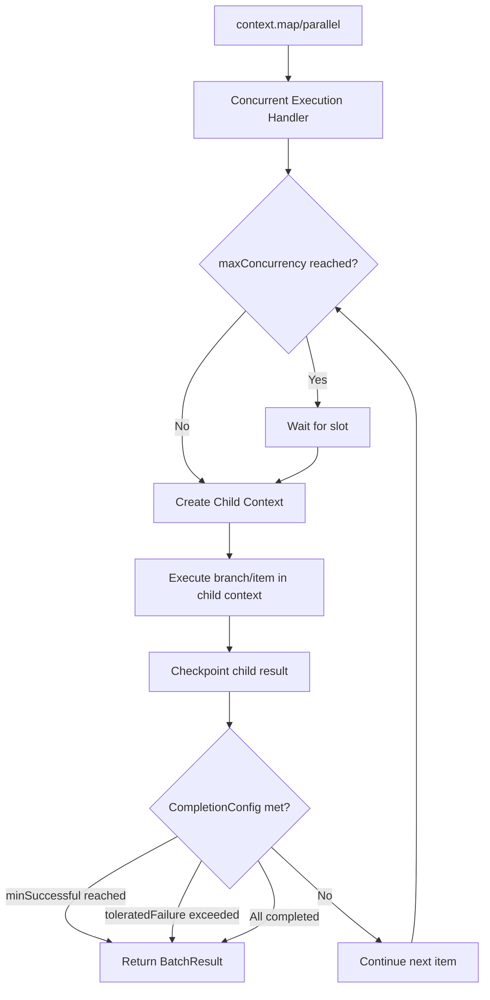

# Threading, Concurrency, and Execution Model

This chapter explores how the SDK manages concurrent operations, coordinates state persistence, and controls the execution lifecycle. While JavaScript is single-threaded, the SDK uses asynchronous patterns — child contexts, a queue-based checkpoint manager, `Promise.race` for lifecycle control, and `EventEmitter`-based communication — to orchestrate complex concurrent workflows deterministically.

Understanding these internals is essential for reasoning about what happens when `map`, `parallel`, or `runInChildContext` operations execute, and how the SDK decides when to suspend or terminate a Lambda invocation.

## Child Contexts and Deterministic Replay

### The Problem: Step Counter Conflicts

Every durable operation needs a unique, deterministic identifier so the SDK can match it to its checkpointed result during replay. The SDK generates these identifiers using a simple incrementing counter — each call to `step`, `wait`, `invoke`, or `runInChildContext` increments the counter and produces an ID like `1`, `2`, `3`.

This works perfectly for sequential code. But when operations run concurrently, the order in which promises resolve is non-deterministic. Two concurrent branches calling `context.step(...)` would race for the same counter, producing different IDs across executions:

```typescript
// ❌ BROKEN: Concurrent steps share a counter — IDs depend on resolution order
const a = context.step("fetch-a", async () => fetchA()); // Gets ID "1"
const b = context.step("fetch-b", async () => fetchB()); // Gets ID "2"
// On replay, if fetchB resolves first, IDs swap — checkpoint mismatch!
```

### The Solution: Isolated Step Counters via Child Contexts

Child contexts solve this by giving each concurrent branch its own step counter with a hierarchical prefix. When you call `runInChildContext`, the SDK:

1. Allocates the next step ID from the parent counter (e.g., `1`)
2. Creates a new `DurableContextImpl` with `_stepPrefix` set to that ID
3. Resets `_stepCounter` to `0` in the child

Operations inside the child context produce IDs like `1-1`, `1-2`, `1-3` — scoped to that branch. A sibling child context gets prefix `2`, producing `2-1`, `2-2`, `2-3`. Resolution order no longer matters because each branch has its own ID namespace:

```typescript
// ✅ CORRECT: Each child context has isolated step counters
const branch1 = context.runInChildContext("branch-1", async (ctx) => {
  const a = await ctx.step("fetch-a", async () => fetchA()); // ID: "1-1"
  await ctx.wait({ seconds: 5 });                            // ID: "1-2"
  return a;
});

const branch2 = context.runInChildContext("branch-2", async (ctx) => {
  const b = await ctx.step("fetch-b", async () => fetchB()); // ID: "2-1"
  return b;
});

const [r1, r2] = await context.promise.all([branch1, branch2]);
```

### How Step IDs Are Generated

The `DurableContextImpl` class manages step ID generation through two private members:

- `_stepPrefix`: An optional string inherited from the parent (e.g., `"1"` for the first child context)
- `_stepCounter`: An integer that increments with each operation

The `createStepId()` method combines them:

```typescript
private createStepId(): string {
  this._stepCounter++;
  return this._stepPrefix
    ? `${this._stepPrefix}-${this._stepCounter}`
    : `${this._stepCounter}`;
}
```

This produces a hierarchical ID tree. For deeply nested contexts (e.g., a `map` inside a `parallel` branch), IDs look like `1-2-1`, `1-2-2`, etc. The hierarchy ensures global uniqueness without coordination between branches.

> **Source**: [`durable-context.ts`](../packages/aws-durable-execution-sdk-js/src/context/durable-context/durable-context.ts)

## Checkpoint Manager

The `CheckpointManager` is the central component responsible for persisting operation results to the Lambda Durable Functions backend. It implements a queue-based, batched processing model that decouples operation execution from checkpoint API calls.

### Queue-Based Processing

When an operation completes (a step returns a result, a wait is scheduled, a child context finishes), the handler doesn't call the checkpoint API directly. Instead, it enqueues a `QueuedCheckpoint` item:

```typescript
interface QueuedCheckpoint {
  stepId: string;
  data: Partial<OperationUpdate>;
  resolve: () => void;
  reject: (error: Error) => void;
}
```

The `checkpoint()` method pushes items onto the queue and triggers processing via `setImmediate()` if no batch is currently in flight:

```typescript
async checkpoint(stepId: string, data: Partial<OperationUpdate>): Promise<void> {
  return new Promise<void>((resolve, reject) => {
    this.queue.push({ stepId, data, resolve, reject });
    if (!this.isProcessing) {
      setImmediate(() => this.processQueue());
    }
  });
}
```

Using `setImmediate` allows multiple synchronous checkpoint calls to accumulate in the queue before the first batch is processed. This is particularly important for concurrent operations where several child contexts may complete in rapid succession.

### Batch Processing and Size Limits

The `processQueue()` method drains the queue into batches, respecting two constraints:

| Constraint | Limit | Purpose |
|-----------|-------|---------|
| `MAX_PAYLOAD_SIZE` | 750 KB | Prevents exceeding the Lambda API request size limit |
| `MAX_ITEMS_IN_BATCH` | 250 | Caps the number of operation updates per API call |

Each batch is sent as a single `CheckpointDurableExecution` API call. The response includes a new `CheckpointToken` that the manager stores for subsequent requests. If items remain in the queue after a batch completes, `processQueue()` schedules itself again via `setImmediate`.

### Async Checkpoint Submission

Many operations use fire-and-forget checkpointing for performance. For example, when a step starts execution with `AtLeastOncePerRetry` semantics, the START checkpoint is submitted without awaiting the response:

```typescript
// Fire-and-forget: don't await the checkpoint promise
checkpoint.checkpoint(stepId, {
  Action: "START",
  Type: "STEP",
  // ...
});
```

The step function runs concurrently with the checkpoint API call. Only the final SUCCEED/FAIL checkpoint is awaited, ensuring the result is persisted before the promise resolves to the caller.

### Force Checkpoint

The `forceCheckpoint()` method triggers an immediate queue flush. This is used for polling scenarios where the SDK needs to refresh operation state from the backend — the checkpoint response includes updated operation data that may contain status changes for pending operations (retries, callbacks, waits).

> **Source**: [`checkpoint-manager.ts`](../packages/aws-durable-execution-sdk-js/src/utils/checkpoint/checkpoint-manager.ts)

## The `Promise.race` Lifecycle Model


The `withDurableExecution` wrapper uses `Promise.race` to manage the fundamental tension in durable function execution: the handler may complete normally, or the SDK may need to terminate the invocation early (because a wait was scheduled, a retry is pending, or an error occurred).

### Two Competing Promises

Inside `runHandler`, the SDK creates two promises and races them:

```typescript
const handlerPromise = handler(customerHandlerEvent, durableContext)
  .then((result) => ["handler", result] as const);

const terminationPromise = executionContext.terminationManager
  .getTerminationPromise()
  .then((result) => ["termination", result] as const);

const [resultType, result] = await Promise.race([
  handlerPromise,
  terminationPromise,
]);
```

- **Handler promise**: Resolves when the developer's handler function returns a value. This means all operations completed successfully and the workflow is done.
- **Termination promise**: Resolves when the `TerminationManager` signals that the invocation should end. This happens when the SDK detects that no further progress can be made in the current invocation.

### Outcome Handling

After the race resolves, the SDK inspects which promise won:

| Winner | Reason | SDK Response |
|--------|--------|-------------|
| Handler | Workflow completed | Returns `{ Status: SUCCEEDED, Result: serializedResult }` |
| Termination | `WAIT_SCHEDULED` | Returns `{ Status: PENDING }` — Lambda will re-invoke when the wait expires |
| Termination | `CALLBACK_PENDING` | Returns `{ Status: PENDING }` — Lambda will re-invoke when the callback arrives |
| Termination | `RETRY_SCHEDULED` | Returns `{ Status: PENDING }` — Lambda will re-invoke when the retry timer expires |
| Termination | `CHECKPOINT_FAILED` | Throws the classified error — Lambda treats this as an invocation failure |
| Termination | `SERDES_FAILED` | Throws `SerdesFailedError` — unrecoverable serialization failure |
| Termination | `CONTEXT_VALIDATION_ERROR` | Returns `{ Status: FAILED, Error: ... }` — non-deterministic replay detected |

Before returning, the SDK always calls `checkpointManager.waitForQueueCompletion()` to ensure all pending checkpoint API calls have finished. This prevents data loss when the handler completes but checkpoint batches are still in flight.

> **Source**: [`with-durable-execution.ts`](../packages/aws-durable-execution-sdk-js/src/with-durable-execution.ts)

## Termination Manager

The `TerminationManager` controls when and why a Lambda invocation ends. It extends `EventEmitter` and exposes a single promise that resolves when termination is triggered.

### Architecture

The termination manager is created during execution context initialization and shared across all components:

```typescript
class TerminationManager extends EventEmitter {
  private isTerminated = false;
  private terminationPromise: Promise<TerminationResponse>;
  private resolveTermination?: (result: TerminationResponse) => void;

  constructor() {
    super();
    this.terminationPromise = new Promise((resolve) => {
      this.resolveTermination = resolve;
    });
  }
}
```

The promise is created eagerly in the constructor. When `terminate()` is called, it resolves the promise — which in turn resolves the termination side of the `Promise.race` in `withDurableExecution`.

### `TerminationReason` Variants

The `TerminationReason` enum defines why the SDK is ending the current invocation:

| Reason | Trigger | Effect |
|--------|---------|--------|
| `OPERATION_TERMINATED` | Default reason | Returns `PENDING` |
| `RETRY_SCHEDULED` | A step failed and a retry is scheduled with a delay | Returns `PENDING` — re-invoked after the retry timer |
| `RETRY_INTERRUPTED_STEP` | An `AtMostOncePerRetry` step was interrupted | Returns `PENDING` |
| `WAIT_SCHEDULED` | A `context.wait()` call was checkpointed | Returns `PENDING` — re-invoked after the wait duration |
| `CALLBACK_PENDING` | A `waitForCallback` or `createCallback` is awaiting an external signal | Returns `PENDING` — re-invoked when callback arrives |
| `CHECKPOINT_FAILED` | The checkpoint API returned an error | Throws the classified error (unrecoverable invocation or execution error) |
| `SERDES_FAILED` | Serialization or deserialization of a step result failed | Throws `SerdesFailedError` |
| `CONTEXT_VALIDATION_ERROR` | Replay detected a non-deterministic operation mismatch | Returns `{ Status: FAILED }` with the validation error |
| `CUSTOM` | Application-specific termination | Behavior depends on the provided options |

### Termination Flow

Termination is typically triggered by the checkpoint manager, not directly by operation handlers. The checkpoint manager tracks the lifecycle state of all operations and uses a cooldown-based termination strategy:

1. After each operation state change, `checkAndTerminate()` evaluates whether all operations are in a waiting state (no executing operations, no pending checkpoints)
2. If termination conditions are met, it schedules termination with a cooldown delay (`CHECKPOINT_TERMINATION_COOLDOWN_MS`)
3. After the cooldown, it re-checks conditions — if still valid, it calls `terminationManager.terminate()`
4. The termination manager resolves its promise, which wins the `Promise.race`

The cooldown prevents premature termination when operations complete in rapid succession. A new operation starting during the cooldown period aborts the scheduled termination.

### Cleanup on Termination

When `terminate()` is called, it first signals the checkpoint manager to stop accepting new items (`setTerminating()`), then runs any registered cleanup function before resolving the termination promise:

```typescript
terminate(options: TerminationOptions = {}): void {
  if (this.isTerminated) return;
  this.setCheckpointTerminating?.();
  this.isTerminated = true;
  // Run cleanup, then resolve the termination promise
}
```

Once `isTerminating` is set on the checkpoint manager, all subsequent `checkpoint()` and `forceCheckpoint()` calls return never-resolving promises, effectively freezing any in-progress operations.

> **Source**: [`termination-manager.ts`](../packages/aws-durable-execution-sdk-js/src/termination-manager/termination-manager.ts), [`types.ts`](../packages/aws-durable-execution-sdk-js/src/termination-manager/types.ts)

## `EventEmitter`-Based Step Data Communication

The SDK uses a Node.js `EventEmitter` to propagate checkpoint response data from the checkpoint manager to operation handlers that are waiting for status changes.

### The Communication Pattern

When the checkpoint API responds, it may include updated operation data in `NewExecutionState.Operations`. The checkpoint manager writes these updates into the shared `stepData` record and emits a `STEP_DATA_UPDATED_EVENT`:

```typescript
// In CheckpointManager.updateStepDataFromCheckpointResponse():
this.stepData[operation.Id] = operation;
this.stepDataEmitter.emit(STEP_DATA_UPDATED_EVENT, operation.Id);
```

This event-driven approach is used for operations that need to wait for backend-driven state changes:

- **Retry timers**: A step that failed and is waiting for its retry delay to expire. The checkpoint manager polls the backend via `forceCheckpoint()` and resolves the waiting promise when the step's status changes from `PENDING` to `SUCCEEDED` or `FAILED`.
- **Callbacks**: A `waitForCallback` operation that is waiting for an external system to call `SendDurableExecutionCallbackSuccess`. The checkpoint response includes the updated callback status.
- **Wait operations**: Similar to callbacks — the backend updates the operation status when the wait duration expires.

### Resolver Pattern

Rather than using the `EventEmitter` for direct event subscription, the checkpoint manager uses a resolver pattern. Each waiting operation stores a `resolver` function on its `OperationInfo` entry:

```typescript
waitForStatusChange(stepId: string): Promise<void> {
  const op = this.operations.get(stepId);
  // Start polling timer
  this.startTimerWithPolling(stepId, op.endTimestamp);
  // Return promise that resolves when status changes
  return new Promise((resolve) => {
    op.resolver = resolve;
  });
}
```

When `updateStepDataFromCheckpointResponse` detects a status change, it calls `resolveWaitingOperation()`, which finds the matching operation and invokes its resolver. This wakes up the waiting handler, which can then read the updated step data and continue execution.

### Polling with Backoff

For operations waiting on backend state changes, the checkpoint manager implements a polling strategy with incremental backoff:

1. Initial poll after the expected end timestamp (or 1 second if no timestamp)
2. Each subsequent poll increases the delay by 1 second, up to a maximum of 10 seconds
3. Polling stops after 15 minutes to prevent indefinite resource consumption

Each poll calls `forceCheckpoint()`, which flushes the queue and receives fresh operation state from the backend.

> **Source**: [`checkpoint-manager.ts`](../packages/aws-durable-execution-sdk-js/src/utils/checkpoint/checkpoint-manager.ts)

## Execution Context Initialization

Before the handler runs, the SDK initializes the execution context by loading all previously checkpointed operation history. This is the foundation for replay — without the complete history, the SDK cannot determine which operations to skip.

### The Initialization Process

The `initializeExecutionContext` function performs these steps:

1. **Extract invocation metadata**: Reads `CheckpointToken` and `DurableExecutionArn` from the `DurableExecutionInvocationInput`
2. **Create the durable execution client**: Either uses a custom client (if provided via `DurableExecutionInvocationInputWithClient`) or creates a new `DurableExecutionApiClient`
3. **Load operation history**: Copies the `Operations` array from `InitialExecutionState`
4. **Paginate if necessary**: If `NextMarker` is present, fetches additional pages via `getExecutionState` until all operations are loaded
5. **Determine execution mode**: If more than one operation exists in history, the SDK starts in `ReplayMode`; otherwise, it starts in `ExecutionMode`
6. **Build the step data map**: Converts the operations array into a `Record<string, Operation>` keyed by operation ID for O(1) lookups

### Operation History Pagination

The Lambda backend may split large operation histories across multiple pages. The SDK handles this transparently during initialization:

```typescript
const operationsArray = [...(event.InitialExecutionState.Operations || [])];
let nextMarker = event.InitialExecutionState.NextMarker;

while (nextMarker) {
  const response = await durableExecutionClient.getExecutionState({
    CheckpointToken: checkpointToken,
    Marker: nextMarker,
    DurableExecutionArn: durableExecutionArn,
    MaxItems: 1000,
  });
  operationsArray.push(...(response.Operations || []));
  nextMarker = response.NextMarker || "";
}
```

Each page requests up to 1,000 operations. The loop continues until `NextMarker` is empty, ensuring the SDK has the complete history before the handler starts executing.

### The Execution Context Object

The initialized context is a plain object shared across all components:

```typescript
{
  durableExecutionClient,        // Client for checkpoint and state APIs
  _stepData,                     // Record<string, Operation> — the operation history
  terminationManager,            // Controls invocation lifecycle
  durableExecutionArn,           // ARN of this durable execution
  pendingCompletions,            // Set of step IDs with pending completions
  getStepData(stepId),           // Lookup function (handles ID hashing)
  tenantId,                      // From Lambda context
  requestId,                     // From Lambda context
}
```

This object is passed to the `DurableContextImpl` constructor, the checkpoint manager, and all operation handlers. It serves as the shared state backbone for the entire invocation.

> **Source**: [`execution-context.ts`](../packages/aws-durable-execution-sdk-js/src/context/execution-context/execution-context.ts)

## Concurrent Execution: `map` and `parallel`

Both `map` and `parallel` use the same underlying `ConcurrencyController` to coordinate concurrent child context executions. The controller manages concurrency limits, tracks completion status, and determines when to stop based on the `CompletionConfig`.

### Concurrent Execution Model



### How It Works

When `context.map(items, executor, config)` or `context.parallel(branches, config)` is called:

1. **Wrap in a parent child context**: The entire concurrent operation runs inside a `runInChildContext` call, giving it an isolated step counter namespace.

2. **Create the `ConcurrencyController`**: This class manages the execution loop, tracking `activeCount`, `completedCount`, `successCount`, and `failureCount`.

3. **Start items up to `maxConcurrency`**: The `tryStartNext()` function launches items by calling `parentContext.runInChildContext()` for each one. Each item gets its own child context with an isolated step counter.

4. **Track completion**: As each child context resolves or rejects, `onComplete()` decrements `activeCount`, updates counters, and checks whether to start more items or finish.

5. **Evaluate `CompletionConfig`**: The controller checks three conditions:
   - `minSuccessful`: If enough items succeeded, stop early (remaining items get `STARTED` status)
   - `toleratedFailureCount` / `toleratedFailurePercentage`: If too many items failed, stop early
   - All items completed: Natural completion

6. **Return `BatchResult`**: The result includes all items with their status (`SUCCEEDED`, `FAILED`, or `STARTED` for items that were launched but not yet completed when early termination occurred).

### Replay Behavior

During replay, the `ConcurrencyController` uses an optimized path. Instead of re-executing items concurrently, it replays them sequentially:

1. Reads the `totalCount` from the parent context's checkpoint summary to know how many items completed in the original execution
2. Iterates through items sequentially, calling `runInChildContext` for each
3. Skips items that didn't complete in the original execution (using `skipNextOperation()` to maintain step counter alignment)
4. Each child context enters `ReplaySucceededContext` mode, returning checkpointed results without re-executing step functions

This sequential replay is safe because child contexts have isolated step counters — the replay produces the same IDs regardless of execution order.

### Concurrency Control Internals

The `maxConcurrency` limit is enforced through a simple counter pattern:

```typescript
const tryStartNext = (): void => {
  while (activeCount < maxConcurrency && currentIndex < items.length && shouldContinue()) {
    activeCount++;
    // Launch item in child context...
    parentContext.runInChildContext(item.name, (childContext) => executor(item, childContext))
      .then(onComplete, onComplete);
  }
};
```

Since JavaScript is single-threaded, there's no need for locks or mutexes. The `activeCount` check and increment happen synchronously before the async child context execution begins. When a child context completes, `onComplete` decrements `activeCount` and calls `tryStartNext()` again to fill the freed slot.

> **Source**: [`concurrent-execution-handler.ts`](../packages/aws-durable-execution-sdk-js/src/handlers/concurrent-execution-handler/concurrent-execution-handler.ts), [`run-in-child-context-handler.ts`](../packages/aws-durable-execution-sdk-js/src/handlers/run-in-child-context-handler/run-in-child-context-handler.ts)

---

[← Previous: API Interaction and Request Paths](./04-api-interaction.md) | [Next: Configuration Reference →](./06-configuration-reference.md)
