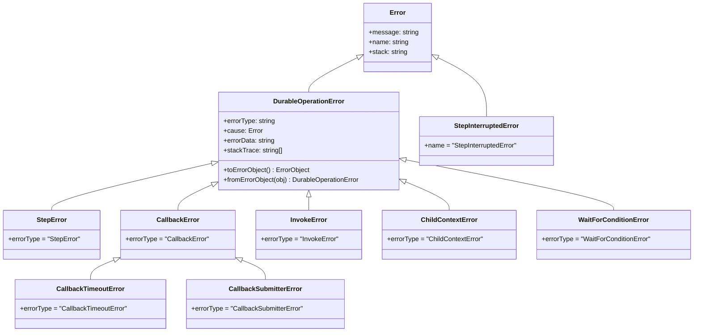

# Error Handling

Durable functions persist operation results across checkpoints. When an operation fails, the SDK must serialize the error, store it alongside the checkpoint, and reconstruct it faithfully on replay. This chapter covers the error type hierarchy, how errors survive serialization boundaries, the distinction between recoverable and unrecoverable failures, and patterns for handling errors in batch operations and multi-step workflows.

## Error Hierarchy

The SDK defines a structured error hierarchy rooted in `DurableOperationError`. Every error thrown by a durable operation (step, callback, invoke, child context, wait-for-condition) extends this base class, which carries the metadata needed for checkpoint serialization. `StepInterruptedError` is the one exception — it extends `Error` directly because it represents an interruption during step execution rather than a completed-and-failed operation.



Source: [`durable-error.ts`](../packages/aws-durable-execution-sdk-js/src/errors/durable-error/durable-error.ts), [`step-errors.ts`](../packages/aws-durable-execution-sdk-js/src/errors/step-errors/step-errors.ts)

## Error Types

### `DurableOperationError`

The abstract base class for all durable operation errors. It is never instantiated directly — concrete subclasses represent specific failure modes.

| Property | Type | Description |
|----------|------|-------------|
| `errorType` | `string` | Abstract. Identifies the error subclass (e.g., `"StepError"`, `"InvokeError"`). Used as the discriminator during serialization. |
| `cause` | `Error \| undefined` | The original error that triggered the failure. |
| `errorData` | `string \| undefined` | Arbitrary string payload attached to the error. Preserved across checkpoints. |
| `stackTrace` | `string[] \| undefined` | Stack trace lines from the `cause`, captured when stack trace storage is enabled. |

Key methods:

- `toErrorObject(): ErrorObject` — Serializes the error into the `ErrorObject` structure used by the checkpoint API.
- `static fromErrorObject(obj: ErrorObject): DurableOperationError` — Reconstructs the appropriate error subclass from a serialized `ErrorObject`. Uses the `ErrorType` field to determine which subclass to instantiate. Falls back to `StepError` for unrecognized types.

```typescript
// Construction
const error = new StepError("Payment failed", originalError, '{"code":"INSUFFICIENT_FUNDS"}');

// Serialization round-trip
const serialized: ErrorObject = error.toErrorObject();
const reconstructed = DurableOperationError.fromErrorObject(serialized);
// reconstructed is a StepError with the same message, cause, and errorData
```

### `StepError`

Thrown when a `context.step()` operation fails. This is the most common error type — any exception thrown inside a step function is caught, checkpointed, and re-thrown as a `StepError` on replay.

```typescript
try {
  await context.step("charge-payment", async () => {
    const result = await paymentService.charge(order);
    if (!result.success) throw new Error("Charge declined");
    return result;
  });
} catch (error) {
  if (error instanceof StepError) {
    // error.cause contains the original "Charge declined" Error
    // error.errorData may contain additional context
  }
}
```

### `CallbackError`

Thrown when a callback operation fails for a reason other than timeout or submitter failure. This is the base class for the two more specific callback errors below.

### `CallbackTimeoutError`

Thrown when a `waitForCallback` or `createCallback` operation exceeds its configured `timeout` duration without receiving a response. Extends `CallbackError`.

```typescript
try {
  const approval = await context.waitForCallback(
    "wait-for-approval",
    async (callbackId) => { await sendApprovalRequest(callbackId); },
    { timeout: { hours: 24 } },
  );
} catch (error) {
  if (error instanceof CallbackTimeoutError) {
    // The 24-hour window expired without a callback response
  }
}
```

### `CallbackSubmitterError`

Thrown when the submitter function passed to `waitForCallback` throws an error. The submitter is the function responsible for sending the callback ID to an external system. Extends `CallbackError`.

```typescript
try {
  const result = await context.waitForCallback(
    "external-review",
    async (callbackId) => {
      // If this throws, a CallbackSubmitterError is raised
      await externalApi.submitForReview(callbackId);
    },
  );
} catch (error) {
  if (error instanceof CallbackSubmitterError) {
    // The submitter function failed — the external system was never notified
  }
}
```

### `InvokeError`

Thrown when a `context.invoke()` call to another durable function fails. The target function may have returned a `FAILED` status, or the invocation itself may have encountered an error.

```typescript
try {
  const result = await context.invoke(
    "call-payment-service",
    process.env.PAYMENT_FUNCTION_ARN!,
    { orderId: "order-123" },
  );
} catch (error) {
  if (error instanceof InvokeError) {
    // The invoked function failed or the invocation could not complete
  }
}
```

### `ChildContextError`

Thrown when a `context.runInChildContext()` operation fails. The child context's error is wrapped in a `ChildContextError`. This is also the error type used in `BatchResult` items from `map` and `parallel` operations, since each item runs in its own child context.

```typescript
try {
  const result = await context.runInChildContext("process-order", async (childCtx) => {
    const validated = await childCtx.step("validate", async () => validate(data));
    await childCtx.step("persist", async () => save(validated));
    return validated;
  });
} catch (error) {
  if (error instanceof ChildContextError) {
    // One of the child context's operations failed
  }
}
```

### `WaitForConditionError`

Thrown when a `context.waitForCondition()` operation fails. This can happen if the check function throws, or if the wait strategy determines the condition will never be met.

```typescript
try {
  const finalState = await context.waitForCondition(
    "wait-for-deployment",
    async (state) => {
      const status = await checkDeploymentStatus(state.deploymentId);
      return { ...state, status };
    },
    {
      initialState: { deploymentId: "deploy-123", status: "IN_PROGRESS" },
      waitStrategy: (state, attempt) => ({
        shouldContinue: state.status !== "COMPLETED" && attempt < 30,
        delay: { seconds: 10 },
      }),
    },
  );
} catch (error) {
  if (error instanceof WaitForConditionError) {
    // The condition check failed or the strategy gave up
  }
}
```

### `StepInterruptedError`

Thrown when a step using `AtMostOncePerRetry` semantics was started but interrupted before completion. Unlike all other error types, `StepInterruptedError` extends `Error` directly — not `DurableOperationError`. This is because the step never completed, so there is no checkpointed result or error to serialize. The interruption means the step's side effects may or may not have occurred.

```typescript
try {
  await context.step("charge-once", async () => processPayment(), {
    semantics: StepSemantics.AtMostOncePerRetry,
    retryStrategy: () => ({ shouldRetry: false }),
  });
} catch (error) {
  if (error instanceof StepInterruptedError) {
    // The step started but was interrupted — the payment may or may not have been processed
  }
}
```

Source: [`step-errors.ts`](../packages/aws-durable-execution-sdk-js/src/errors/step-errors/step-errors.ts)

## Error Serialization Across Checkpoints

When a durable operation fails, the error must survive the checkpoint boundary. The SDK serializes errors into an `ErrorObject` structure — the same structure used by the Lambda Durable Functions checkpoint API. On replay, the SDK reconstructs the appropriate error subclass from the stored `ErrorObject`.

### The `ErrorObject` Structure

`ErrorObject` is defined by the `@aws-sdk/client-lambda` package and has four fields:

| Field | Type | Description |
|-------|------|-------------|
| `ErrorType` | `string \| undefined` | The error class name (e.g., `"StepError"`, `"CallbackTimeoutError"`). Used by `fromErrorObject` to determine which subclass to instantiate. |
| `ErrorMessage` | `string \| undefined` | The error message. |
| `ErrorData` | `string \| undefined` | Arbitrary string data attached to the error. Useful for carrying structured context (e.g., a JSON-encoded error code). |
| `StackTrace` | `string[] \| undefined` | Stack trace lines. Only populated when stack trace storage is enabled via the `STORE_STACK_TRACES` constant. |

### Serialization Flow

1. An operation (step, callback, invoke, etc.) throws an error.
2. The handler catches the error and calls `createErrorObjectFromError(error)` to produce an `ErrorObject`.
   - If the error is a `DurableOperationError`, its `toErrorObject()` method is used directly.
   - If the error is a plain `Error`, the function extracts `name`, `message`, and optionally `stack`.
   - If the error is not an `Error` instance, a generic `ErrorObject` with `"Unknown error"` is created.
3. The `ErrorObject` is included in the checkpoint payload sent to the Lambda checkpoint API.
4. On replay, the SDK reads the `ErrorObject` from the operation history and calls `DurableOperationError.fromErrorObject(errorObject)` to reconstruct the typed error.
5. The reconstructed error is thrown to the handler code, preserving the same type and message as the original.

Source: [`error-object.ts`](../packages/aws-durable-execution-sdk-js/src/utils/error-object/error-object.ts)

```typescript
// How the SDK serializes errors internally
import { createErrorObjectFromError } from "../utils/error-object/error-object";

// Any error → ErrorObject
const errorObject = createErrorObjectFromError(caughtError);
// { ErrorType: "StepError", ErrorMessage: "Payment failed", ErrorData: undefined, StackTrace: [...] }

// ErrorObject → typed DurableOperationError
const reconstructed = DurableOperationError.fromErrorObject(errorObject);
// reconstructed instanceof StepError === true
```

## Recoverable vs Unrecoverable Errors

The SDK distinguishes between two categories of errors based on whether the execution can continue.

### Recoverable Errors (Retry-Eligible)

Recoverable errors are operation-level failures that the retry strategy can handle. When a step throws an error, the SDK consults the configured `retryStrategy` to decide whether to retry:

```typescript
await context.step("flaky-api-call", async () => {
  return await externalApi.call();
}, {
  retryStrategy: (error, attemptCount) => ({
    shouldRetry: attemptCount < 3,
    delay: { seconds: Math.pow(2, attemptCount) },
  }),
});
```

If `shouldRetry` is `true`, the SDK schedules a retry with the specified delay. The step function executes again on the next invocation. If `shouldRetry` is `false` (or max attempts are exhausted), the error is checkpointed as a failure and thrown to the handler as a `DurableOperationError` subclass.

The `createRetryStrategy` factory supports filtering which errors are retryable via `retryableErrors` (message pattern matching) and `retryableErrorTypes` (instanceof checks). When neither filter is specified, all errors are retried by default. When either is specified, only matching errors trigger retries.

All `DurableOperationError` subclasses (`StepError`, `CallbackError`, `InvokeError`, etc.) are recoverable in the sense that they represent completed-and-failed operations. The handler code can catch them and decide how to proceed — including compensating transactions (see [Saga Pattern](#saga-pattern) below).

### Unrecoverable Errors

Unrecoverable errors represent fatal conditions that prevent the execution from continuing. These extend the `UnrecoverableError` base class (not `DurableOperationError`) and carry a `terminationReason` that tells the termination manager how to shut down.

There are two levels of severity:

| Level | Base Class | Behavior |
|-------|-----------|----------|
| Invocation-level | `UnrecoverableInvocationError` | Terminates the current Lambda invocation. The execution may continue with a new invocation. |
| Execution-level | `UnrecoverableExecutionError` | Terminates the entire durable execution permanently. |

Common unrecoverable error types:

| Error | Level | Termination Reason | Cause |
|-------|-------|-------------------|-------|
| `CheckpointUnrecoverableInvocationError` | Invocation | `CHECKPOINT_FAILED` | Checkpoint API returned a 5xx error or invalid token |
| `CheckpointUnrecoverableExecutionError` | Execution | `CHECKPOINT_FAILED` | Checkpoint API returned a 4xx error (other than invalid token) |
| `SerdesFailedError` | Invocation | `SERDES_FAILED` | Serialization or deserialization of a step result failed |
| `NonDeterministicExecutionError` | Execution | `CUSTOM` | Non-deterministic code detected during replay |

These errors are not catchable by handler code. They trigger the termination manager, which races against the handler promise via `Promise.race` in `withDurableExecution` to shut down the Lambda invocation.

Source: [`unrecoverable-error.ts`](../packages/aws-durable-execution-sdk-js/src/errors/unrecoverable-error/unrecoverable-error.ts), [`checkpoint-errors.ts`](../packages/aws-durable-execution-sdk-js/src/errors/checkpoint-errors/checkpoint-errors.ts), [`serdes-errors.ts`](../packages/aws-durable-execution-sdk-js/src/errors/serdes-errors/serdes-errors.ts), [`non-deterministic-error.ts`](../packages/aws-durable-execution-sdk-js/src/errors/non-deterministic-error/non-deterministic-error.ts)

## `BatchResult` Error Handling

The `map` and `parallel` operations return a [`BatchResult<R>`](../packages/aws-durable-execution-sdk-js/src/types/batch.ts) that aggregates results and errors from all child contexts. Since each item runs in its own child context, individual failures produce `ChildContextError` instances.

### Key Properties and Methods

| Member | Type | Description |
|--------|------|-------------|
| `all` | `Array<BatchItem<R>>` | Every item with its result, error, index, and status. |
| `hasFailure` | `boolean` | `true` if any item has `FAILED` status. |
| `status` | `"SUCCEEDED" \| "FAILED"` | `SUCCEEDED` if no failures, `FAILED` otherwise. |
| `completionReason` | `string` | Why the batch finished: `"ALL_COMPLETED"`, `"MIN_SUCCESSFUL_REACHED"`, or `"FAILURE_TOLERANCE_EXCEEDED"`. |
| `successCount` | `number` | Number of items that succeeded. |
| `failureCount` | `number` | Number of items that failed. |
| `throwIfError()` | `void` | Throws the first `ChildContextError` if any item failed. A quick way to fail-fast. |
| `getResults()` | `Array<R>` | Returns all successful results. |
| `getErrors()` | `Array<ChildContextError>` | Returns all errors from failed items. |
| `succeeded()` | `Array<BatchItem<R>>` | Returns only items with `SUCCEEDED` status. |
| `failed()` | `Array<BatchItem<R>>` | Returns only items with `FAILED` status, each guaranteed to have an `error` property. |
| `started()` | `Array<BatchItem<R>>` | Returns items still in progress (status `STARTED`). |

### Usage Example

```typescript
const results = await context.map(
  "process-orders",
  orders,
  async (ctx, order, index) => {
    return await ctx.step(`process-${index}`, async () => processOrder(order));
  },
  {
    maxConcurrency: 5,
    completionConfig: {
      toleratedFailureCount: 2,
    },
  },
);

// Option 1: Fail fast — throw the first error
results.throwIfError();

// Option 2: Inspect failures individually
if (results.hasFailure) {
  for (const failedItem of results.failed()) {
    console.error(`Order ${failedItem.index} failed:`, failedItem.error.message);
  }
}

// Option 3: Collect all errors
const errors = results.getErrors();
if (errors.length > 0) {
  await context.step("report-failures", async () => {
    await alertService.notify(`${errors.length} orders failed`, errors.map(e => e.message));
  });
}

// Get successful results regardless of failures
const successfulResults = results.getResults();
```

Source: [`batch-result.ts`](../packages/aws-durable-execution-sdk-js/src/handlers/concurrent-execution-handler/batch-result.ts), [`batch.ts`](../packages/aws-durable-execution-sdk-js/src/types/batch.ts)

## Saga Pattern

The saga pattern uses compensating transactions to undo completed steps when a later step fails. Each successful step registers a compensation function. If any step throws, the compensations run in reverse order to restore consistency.

```typescript
import { withDurableExecution, DurableContext } from "@aws/durable-execution-sdk-js";

export const handler = withDurableExecution(async (event: any, context: DurableContext) => {
  const compensations: Array<{ name: string; fn: () => Promise<void> }> = [];

  try {
    // Step 1: Reserve inventory
    const reservation = await context.step("reserve-inventory", async () => {
      return await inventoryService.reserve(event.items);
    });
    compensations.push({
      name: "release-inventory",
      fn: () => inventoryService.release(reservation.reservationId),
    });

    // Step 2: Charge payment
    const payment = await context.step("charge-payment", async () => {
      return await paymentService.charge(event.paymentMethod, event.total);
    });
    compensations.push({
      name: "refund-payment",
      fn: () => paymentService.refund(payment.transactionId),
    });

    // Step 3: Create shipment
    const shipment = await context.step("create-shipment", async () => {
      return await shippingService.createShipment(event.address, reservation);
    });

    return { success: true, shipmentId: shipment.id };
  } catch (error) {
    // Run compensations in reverse order
    for (const compensation of compensations.reverse()) {
      await context.step(compensation.name, async () => {
        await compensation.fn();
      });
    }
    throw error;
  }
});
```

Each compensation runs inside its own `context.step`, so it is checkpointed independently. If the Lambda invocation is interrupted during compensation, replay will skip already-completed compensations and continue with the remaining ones.

---

[← Previous: Configuration Reference](./06-configuration-reference.md) | [Next: Testing →](./08-testing.md)
